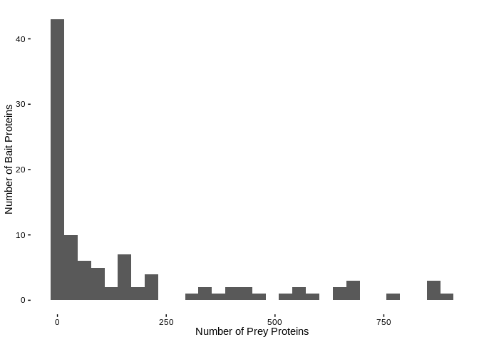
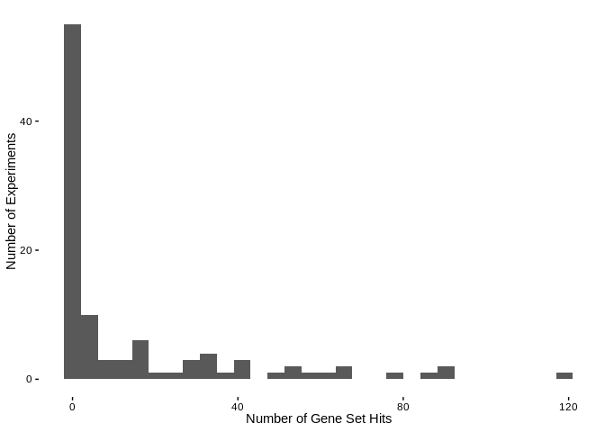
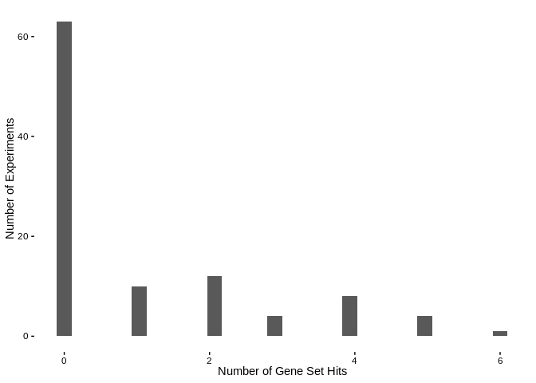
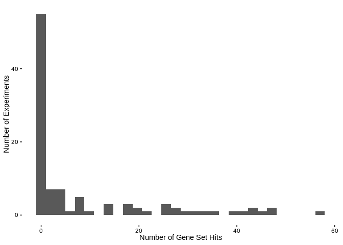

Proximity Labeled PPI GSEA Analysis
================
Matthew Berginski
2022-03-07

Let’s load the data and make a quick histogram showing the number of
prey for each experiment ID.

<!-- -->

My strategy for the rest of this analysis is to load a gene set and then
run a standard gene set enrichment for each of the Prey protein lists
corresponding to each bait. There are many different possible lists to
use (<http://www.gsea-msigdb.org/gsea/msigdb/index.jsp>). Trying out any
the lists on that website is very easy, but I’ve picked out three that
we happen to like. To deal with the fact that I’m going to be running 99
of these tests, I’ve divided the FDR target (0.01) by that number.

As for how to visualize/use all these results, let me know what you
think. For now, I’ve shown the distribution of gene set hit counts and
pulled out the top 10 most observed gene set hits.

# Reactome

The REACTOME gene sets includes 1604 gene sets. Of the 99 bait proteins,
53 have a hit in the REACTOME gene sets. The distribution of the number
of hits for each experiment look like this:

<!-- -->

Looking at the gene sets that appear often in the hit list, here are the
10 gene sets with the most hits in the set:

<table>
<thead>
<tr>
<th style="text-align:left;">
label
</th>
<th style="text-align:right;">
Number of Appearances
</th>
<th style="text-align:right;">
Fraction of Sets with Hits
</th>
</tr>
</thead>
<tbody>
<tr>
<td style="text-align:left;">
REACTOME_SIGNALING_BY_RHO_GTPASES_MIRO_GTPASES_AND_RHOBTB3
</td>
<td style="text-align:right;">
27
</td>
<td style="text-align:right;">
0.509
</td>
</tr>
<tr>
<td style="text-align:left;">
REACTOME_CELL_CYCLE
</td>
<td style="text-align:right;">
26
</td>
<td style="text-align:right;">
0.491
</td>
</tr>
<tr>
<td style="text-align:left;">
REACTOME_RHO_GTPASE_CYCLE
</td>
<td style="text-align:right;">
26
</td>
<td style="text-align:right;">
0.491
</td>
</tr>
<tr>
<td style="text-align:left;">
REACTOME_MEMBRANE_TRAFFICKING
</td>
<td style="text-align:right;">
22
</td>
<td style="text-align:right;">
0.415
</td>
</tr>
<tr>
<td style="text-align:left;">
REACTOME_CELL_CYCLE_MITOTIC
</td>
<td style="text-align:right;">
21
</td>
<td style="text-align:right;">
0.396
</td>
</tr>
<tr>
<td style="text-align:left;">
REACTOME_METABOLISM_OF_RNA
</td>
<td style="text-align:right;">
21
</td>
<td style="text-align:right;">
0.396
</td>
</tr>
<tr>
<td style="text-align:left;">
REACTOME_VESICLE_MEDIATED_TRANSPORT
</td>
<td style="text-align:right;">
20
</td>
<td style="text-align:right;">
0.377
</td>
</tr>
<tr>
<td style="text-align:left;">
REACTOME_MITOTIC_PROMETAPHASE
</td>
<td style="text-align:right;">
19
</td>
<td style="text-align:right;">
0.358
</td>
</tr>
<tr>
<td style="text-align:left;">
REACTOME_PROCESSING_OF_CAPPED_INTRON_CONTAINING_PRE_MRNA
</td>
<td style="text-align:right;">
18
</td>
<td style="text-align:right;">
0.340
</td>
</tr>
<tr>
<td style="text-align:left;">
REACTOME_RAC3_GTPASE_CYCLE
</td>
<td style="text-align:right;">
18
</td>
<td style="text-align:right;">
0.340
</td>
</tr>
</tbody>
</table>

# Hallmark

The hallmark gene sets includes 50 gene sets. Of the 99 bait proteins,
39 have a hit in the hallmark gene sets. The distribution of the number
of hits for each experiment look like this:

<!-- -->

Looking at the gene sets that appear often in the hit list, here are the
10 gene sets with the most hits in the set:

<table>
<thead>
<tr>
<th style="text-align:left;">
label
</th>
<th style="text-align:right;">
Number of Appearances
</th>
<th style="text-align:right;">
Fraction of Sets with Hits
</th>
</tr>
</thead>
<tbody>
<tr>
<td style="text-align:left;">
HALLMARK_MITOTIC_SPINDLE
</td>
<td style="text-align:right;">
26
</td>
<td style="text-align:right;">
0.6670
</td>
</tr>
<tr>
<td style="text-align:left;">
HALLMARK_E2F_TARGETS
</td>
<td style="text-align:right;">
17
</td>
<td style="text-align:right;">
0.4360
</td>
</tr>
<tr>
<td style="text-align:left;">
HALLMARK_G2M_CHECKPOINT
</td>
<td style="text-align:right;">
13
</td>
<td style="text-align:right;">
0.3330
</td>
</tr>
<tr>
<td style="text-align:left;">
HALLMARK_PROTEIN_SECRETION
</td>
<td style="text-align:right;">
8
</td>
<td style="text-align:right;">
0.2050
</td>
</tr>
<tr>
<td style="text-align:left;">
HALLMARK_DNA_REPAIR
</td>
<td style="text-align:right;">
7
</td>
<td style="text-align:right;">
0.1790
</td>
</tr>
<tr>
<td style="text-align:left;">
HALLMARK_MYC_TARGETS_V1
</td>
<td style="text-align:right;">
7
</td>
<td style="text-align:right;">
0.1790
</td>
</tr>
<tr>
<td style="text-align:left;">
HALLMARK_APICAL_JUNCTION
</td>
<td style="text-align:right;">
6
</td>
<td style="text-align:right;">
0.1540
</td>
</tr>
<tr>
<td style="text-align:left;">
HALLMARK_MTORC1_SIGNALING
</td>
<td style="text-align:right;">
4
</td>
<td style="text-align:right;">
0.1030
</td>
</tr>
<tr>
<td style="text-align:left;">
HALLMARK_ADIPOGENESIS
</td>
<td style="text-align:right;">
3
</td>
<td style="text-align:right;">
0.0769
</td>
</tr>
<tr>
<td style="text-align:left;">
HALLMARK_OXIDATIVE_PHOSPHORYLATION
</td>
<td style="text-align:right;">
3
</td>
<td style="text-align:right;">
0.0769
</td>
</tr>
</tbody>
</table>

# GO - Molecule Function

The GO Molecule Function gene sets includes 1708 gene sets. Of the 99
bait proteins, 47 have a hit in the GO Molecule Function gene sets. The
distribution of the number of hits for each experiment look like this:

<!-- -->

Looking at the gene sets that appear often in the hit list, here are the
10 gene sets with the most hits in the set:

<table>
<thead>
<tr>
<th style="text-align:left;">
label
</th>
<th style="text-align:right;">
Number of Appearances
</th>
<th style="text-align:right;">
Fraction of Sets with Hits
</th>
</tr>
</thead>
<tbody>
<tr>
<td style="text-align:left;">
GOMF_CADHERIN_BINDING
</td>
<td style="text-align:right;">
25
</td>
<td style="text-align:right;">
0.532
</td>
</tr>
<tr>
<td style="text-align:left;">
GOMF_CELL_ADHESION_MOLECULE_BINDING
</td>
<td style="text-align:right;">
25
</td>
<td style="text-align:right;">
0.532
</td>
</tr>
<tr>
<td style="text-align:left;">
GOMF_ENZYME_BINDING
</td>
<td style="text-align:right;">
25
</td>
<td style="text-align:right;">
0.532
</td>
</tr>
<tr>
<td style="text-align:left;">
GOMF_RNA_BINDING
</td>
<td style="text-align:right;">
24
</td>
<td style="text-align:right;">
0.511
</td>
</tr>
<tr>
<td style="text-align:left;">
GOMF_ADENYL_NUCLEOTIDE_BINDING
</td>
<td style="text-align:right;">
20
</td>
<td style="text-align:right;">
0.426
</td>
</tr>
<tr>
<td style="text-align:left;">
GOMF_CYTOSKELETAL_PROTEIN_BINDING
</td>
<td style="text-align:right;">
20
</td>
<td style="text-align:right;">
0.426
</td>
</tr>
<tr>
<td style="text-align:left;">
GOMF_ACTIN_BINDING
</td>
<td style="text-align:right;">
18
</td>
<td style="text-align:right;">
0.383
</td>
</tr>
<tr>
<td style="text-align:left;">
GOMF_PHOSPHATIDYLINOSITOL_BINDING
</td>
<td style="text-align:right;">
18
</td>
<td style="text-align:right;">
0.383
</td>
</tr>
<tr>
<td style="text-align:left;">
GOMF_RIBONUCLEOTIDE_BINDING
</td>
<td style="text-align:right;">
18
</td>
<td style="text-align:right;">
0.383
</td>
</tr>
<tr>
<td style="text-align:left;">
GOMF_GTPASE_BINDING
</td>
<td style="text-align:right;">
17
</td>
<td style="text-align:right;">
0.362
</td>
</tr>
</tbody>
</table>
